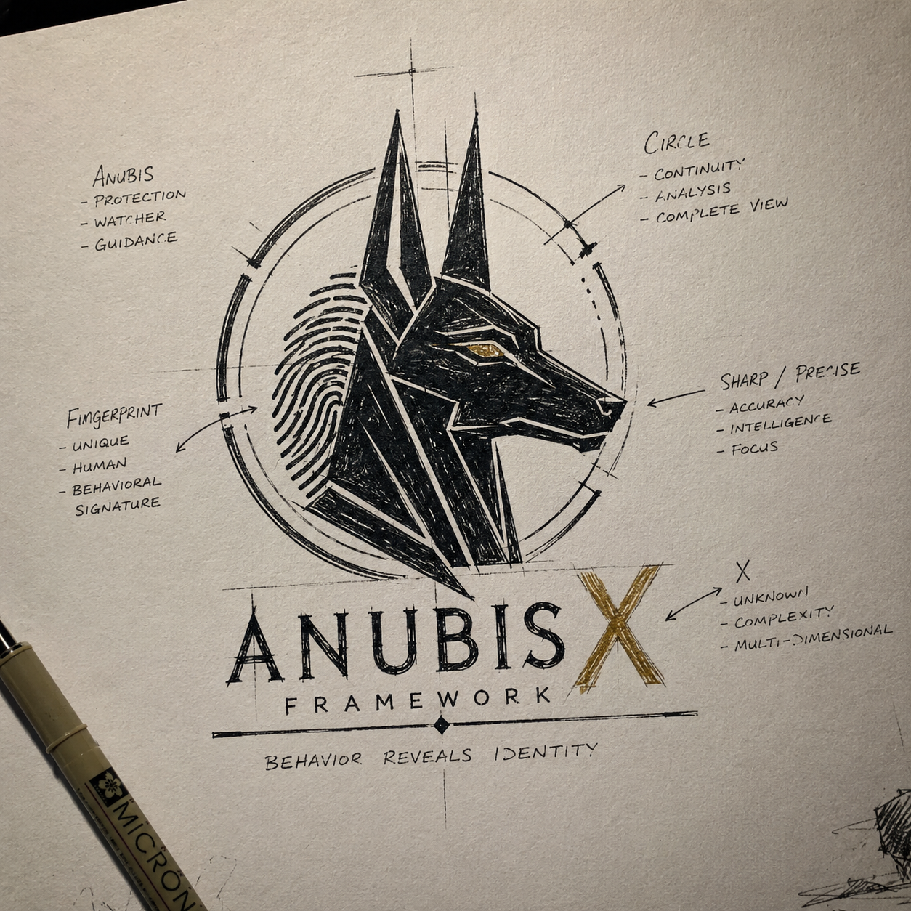

<p align="center">
  
</p>

# AnubisX Framework

**A Scientific Methodology for Behavioral Identity Attribution**

[](https://doi.org/10.5281/zenodo.21446923)
[](https://creativecommons.org/licenses/by/4.0/)
[](https://creativecommons.org/licenses/by/4.0/)

---

## Research Identity

The AnubisX Framework is a formal scientific methodology for determining the identity of a human operator from their digital behavioral patterns. Unlike traditional attribution methods that rely on transient technical artifacts — IP addresses, device fingerprints, browser configurations — the framework measures **persistent human cognitive signatures** that are rooted in stable cognitive processing habits.

**DOI:** [10.5281/zenodo.21446923](https://doi.org/10.5281/zenodo.21446923)  
**Figshare:** [10.6084/m9.figshare.33028817](https://doi.org/10.6084/m9.figshare.33028817)  
**Repository:** [https://github.com/AnubisXFramework/AnubisXFramework](https://github.com/AnubisXFramework/AnubisXFramework)  
**Website:** [https://anubisxframework.github.io](https://anubisxframework.github.io)  
**Mirror:** [https://anubisxframework.nullc0d3.workers.dev](https://anubisxframework.nullc0d3.workers.dev)

**Original Framework**: Ahmed Awad (NullC0d3)  
**Original Research**: Ahmed Awad (NullC0d3)  
**Author Website:** [https://ahmedawadresearch.github.io](https://ahmedawadresearch.github.io)  
**Contact:** [anubisxframework@gmail.com](mailto:anubisxframework@gmail.com)

---

## Research Motivation

Digital attribution — linking digital actions to their human source — is a foundational capability in cyber threat intelligence, digital forensics, and national security. Current methodologies rely primarily on technical artifacts that sophisticated adversaries can spoof or eliminate. Behavioral attribution offers an alternative paradigm: analyzing intrinsic patterns of human cognition observable through digital traces.

The framework addresses three specific limitations:
1. **Fragmentation** — Behavioral attribution methods are developed independently across disciplines without unifying theory
2. **Methodological rigor** — Most work lacks formal, pre-specified validation criteria
3. **Transparency** — Comprehensive documentation of limitations and failure modes is uncommon

---

## Framework Concept

```
┌────────────────────────────────────────────────────────────┐
│                   Decision Layer                            │
├────────────────────────────────────────────────────────────┤
│                   Evidence Layer                            │
├────────────────────────────────────────────────────────────┤
│                  Comparison Layer                           │
├────────────────────────────────────────────────────────────┤
│                  Profile Layer                              │
├────────────────────────────────────────────────────────────┤
│                  Feature Layer                              │
├────────────────────────────────────────────────────────────┤
│                    Data Layer                               │
└────────────────────────────────────────────────────────────┘
```

The framework employs a layered architecture for behavioral evidence processing, supporting multiple analytical workflows and integrating evidence from diverse behavioral modalities.

---

## Scientific Contribution

The framework advances behavioral identity attribution through:

1. **Theoretical Innovation** — A comprehensive axiomatic foundation establishing the logical basis for behavioral attribution
2. **Methodological Rigor** — A formal validation framework with pre-specified acceptance criteria
3. **Multi-Modal Evidence Integration** — A principled approach to fusing evidence from multiple behavioral sources
4. **Empirical Investigation** — Proof-of-concept validation on real-world data

---

## Repository Contents

| Directory | Contents |
|---|---|
| `Documentation/` | Public documentation, theory, architecture overview |
| `Theory/` | Theoretical foundation documents |
| `Mathematics/` | Mathematical foundations |
| `Validation/` | Validation framework and methodology |
| `Whitepaper/` | Complete whitepaper documents |
| `Journal/` | Journal revision and publication materials |
| `Algorithms/` | Algorithm specifications (conceptual) |
| `Research/` | Research methodology and questions |
| `API_Docs/` | API reference documentation (conceptual) |
| `Citation/` | Citation metadata and guides |

---

## Persistent Identifiers

| Platform | Identifier |
|---|---|
| **DOI** | [10.5281/zenodo.21446923](https://doi.org/10.5281/zenodo.21446923) |
| **Figshare** | [10.6084/m9.figshare.33028817](https://doi.org/10.6084/m9.figshare.33028817) |
| **ORCID** | [0009-0005-0654-3393](https://orcid.org/0009-0005-0654-3393) |
| **GitHub** | [AnubisXFramework](https://github.com/AnubisXFramework/AnubisXFramework) |

---

## How to Cite

```bibtex
@software{anubisx2026framework,
  title = {AnubisX Framework: A Scientific Methodology for Behavioral Identity Attribution},
  author = {Awad, Ahmed},
  year = {2026},
  url = {https://github.com/AnubisXFramework/AnubisXFramework},
  doi = {10.5281/zenodo.21446923},
  license = {CC-BY-4.0}
}
```

---

## Academic Profiles

| Platform | Profile |
|---|---|
| ORCID | [0009-0005-0654-3393](https://orcid.org/0009-0005-0654-3393) |
| LinkedIn | [/in/nullc0d3](https://www.linkedin.com/in/nullc0d3/) |
| ResearchGate | [/profile/Ahmed-Awad-118](https://www.researchgate.net/profile/Ahmed-Awad-118) |
| Figshare | [/authors/Ahmed_Awad/24415733](https://figshare.com/authors/Ahmed_Awad/24415733) |

---

## License

This work is licensed under [Creative Commons Attribution 4.0 International](LICENSE.md) (CC BY 4.0).

---

**© 2026 Ahmed Awad (NullC0d3). All rights reserved.**

*Classification: PUBLIC (C0)*
